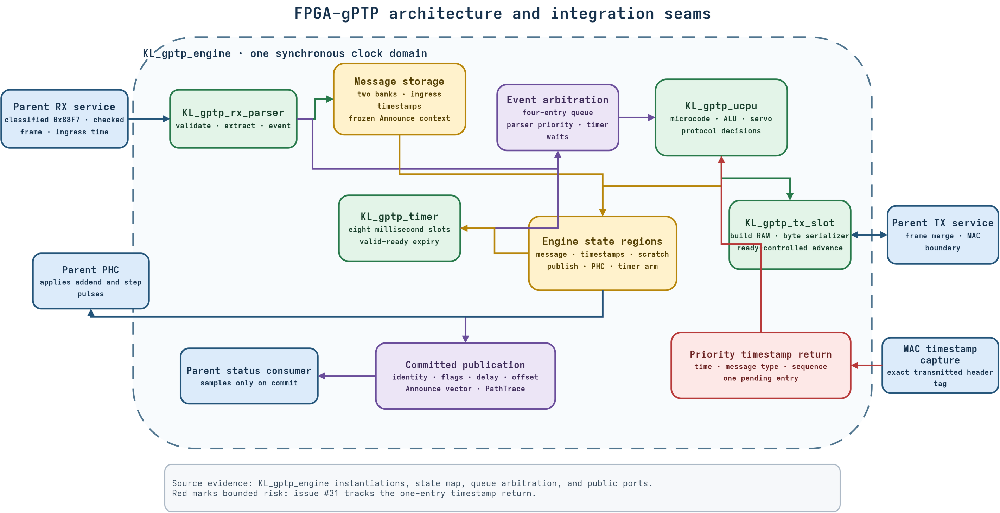
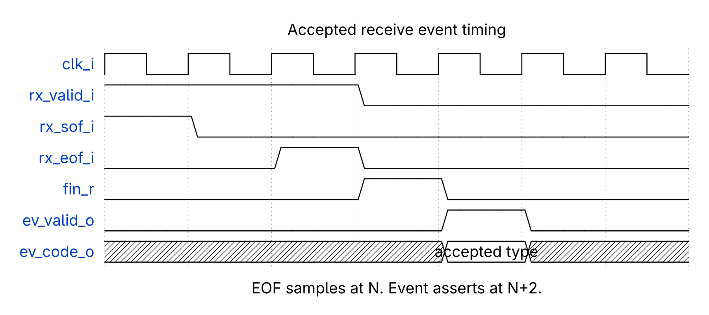
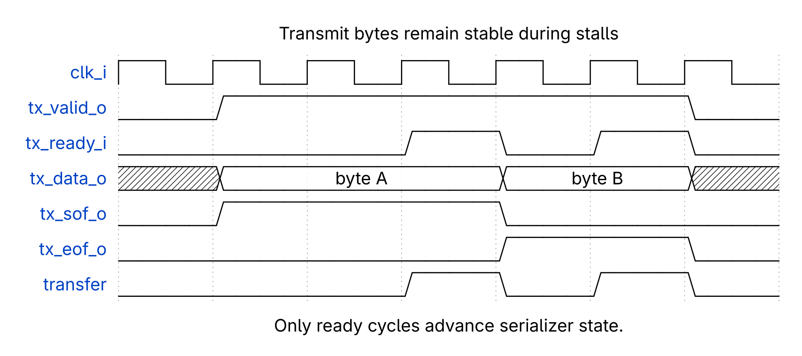

<!-- SPDX-License-Identifier: CERN-OHL-W-2.0 -->
# HDL developer guide

This guide explains structure, timing, and invariants.

The editable source remains [available](diagrams/gptp_architecture.drawio).

## Module map

| Module | Responsibility |
|---|---|
| `KL_gptp_engine` | Integration, queues, state, arbitration |
| `KL_gptp_rx_parser` | Byte parsing and message banking |
| `KL_gptp_ucpu` | Microcode execution and arithmetic |
| `KL_gptp_tx_slot` | Frame construction and serialization |
| `KL_gptp_timer` | Eight millisecond deadline slots |
| `gptp_ucpu_pkg` | Opcodes, constants, event identifiers |

All modules use one clock domain.

## Receive path

The parser accepts one byte each valid cycle.

It validates headers before dispatching events.

Accepted data enters ping-pong message banks.

Ingress timestamps follow the same bank selection.

Announce uses one frozen context.

Chasing Announces become counted drops.

Other event types may continue.

### Receive timing

EOF stores the final parser decision.

Finalization occupies the next cycle.

The accepted event follows finalization.

[WaveDrom source](diagrams/wavedrom/rx_accept.json) defines this timing.

## Event arbitration

- Four entries buffer parser and timer events.
- Parser events win simultaneous queue pushes.
- Timer expiry waits using valid-ready flow control.
- Timestamp returns use a priority side path.
- Dispatch waits until serialization becomes idle.
- Later requests wait behind response ownership.

Never bypass ownership without preserving context.

## State regions

The microCPU uses `st_addr_o[19:16]` for selection.

| Region | Access | Contents |
|---:|---|---|
| 0 | Read-only | Ping-pong message banks |
| 1 | Read-only | Ingress and egress timestamps |
| 2 | Read-write | Sixty-four protocol scratch words |
| 3 | Read-write | Publication staging bank |
| 4 | Write-only | PHC rate and phase controls |
| 5 | Write-only | Timer arming interface |

Scratch storage survives warm resets.

Resettable claim-valid bits do not survive.

## MicroCPU shape

- ROM contains 1,024 forty-eight-bit instructions.
- Register storage contains sixteen sixty-four-bit words.
- Integer logic supports common sixty-four-bit operations.
- Shifts run serially.
- Signed multiplication uses inferred DSP resources.
- Unsigned division runs serially.
- Dispatch preloads event and timestamp registers.
- Multi-cycle operations hold execution safely.

Protocol rates tolerate serial arithmetic.

## Transmit timing

Valid remains asserted during stalls.

Data and markers remain stable during stalls.

State advances only after ready acceptance.

[WaveDrom source](diagrams/wavedrom/tx_backpressure.json) defines this timing.

## Publication invariant

Microcode stages publication values first.

`OP_COMMIT` exposes the complete staged tuple.

Consumers sample only during `pub_commit_o`.

Inactive path entries must remain zero.

## Change checklist

- Preserve single-clock assumptions.
- Preserve valid-ready transfer rules.
- Preserve bank and timestamp pairing.
- Preserve event ownership snapshots.
- Preserve reset-validity separation.
- Update microcode and tests together.
- Add negative and boundary tests.
- Update both WaveDrom sources when timing changes.
- Update Draw.io after structural changes.
- Regenerate every committed diagram.
- Run lint and complete simulations.
