[OBSOLETE + 2026-09-01]

> Status: Historical
>
> Original path: `docs/IP_BLOCKS.md`
>
> Archived: 2026-09-01
>
> Current successor: [current HDL guide](../../../HDL_DEVELOPER.md)

<!-- SPDX-License-Identifier: CERN-OHL-W-2.0 -->
# The IP design book — every block, six ways

Each block in this plane is explained by the six people who have to
care about it. The voices are a device, not decoration: the same block
means different things to the person who chose its shape, the person
who must satisfy IEEE 802.1AS with it, the person who wrote its
handshakes, the person who must prove it, the person who has to
instantiate it in an SoC, and the person watching it on an
oscilloscope at the bench.

> **🏛 The Architect** — why this block exists in this shape, and what
> it cost.
> **📐 The Protocol Engineer** — which clause of 802.1AS-2011 it
> discharges.
> **⚙ The RTL Designer** — interfaces, handshakes, cycle behaviour.
> **🔬 The Verification Engineer** — what proves it, and what would
> break if it regressed.
> **🔌 The Integrator** — how to wire it into the parent SoC.
> **🔭 The Bench Engineer** — what it looks like on real silicon.

All figures here are measured (Vivado 2026.1 OOC, `xc7a100t-2`,
100 MHz) or generated from the sources. Diagrams live in
`docs/diagrams/` (WaveDrom `.json` and Mermaid `.mmd` sources, rendered
`.svg` beside them); the per-module port/signal/process tables in
`docs/generated/` are produced by **TerosHDL** from the RTL itself.
Regenerate everything with `python3 docs/tools/gen_docs.py`.

---

## 0. The whole IP at a glance


| | |
|---|---|
| **Function** | IEEE 802.1AS-2011 (gPTP) end station, one port, 100 Mbit/s or 1 Gbit/s full duplex |
| **Interfaces** | byte-serial RX/TX (`sof`/`eof`), ingress + egress timestamps, PHC snapshot + rate/step knobs, publish bank, one configuration word |
| **Size** | **3,029 LUT · 2,398 FF · 1.5 BRAM · 4 DSP** |
| **Timing** | **+1.898 ns** slack at 100 MHz OOC, 0 failing endpoints |
| **Clocking** | single domain; all CDC lives outside (the parent's, or the bench gaskets') |
| **Protocol state** | 1024×48 µcode ROM (849 words used) + 32×64 scratch |
| **Measured accuracy** | **+0.01 ns mean, σ 3.20 ns** offset vs a commercial AVB switch GM |

**🏛 The Architect.** The whole design rests on one decision: protocol
behaviour is *data*, not logic. A gPTP endpoint is a dozen state
machines that fire at ≤ 8 Hz on millisecond deadlines — implementing
them as fabric would spend thousands of LUTs on gates that are idle
99.99 % of the time. So the plane is a small sequencer with exactly
the datapaths gPTP needs (64-bit add/sub, a serial shifter, one
multiplier, one restoring divider) and a ROM that walks them. The
evidence that this was right: five µcode revisions and a full
conformance audit later, the µCPU is **byte-identical at 1,701 LUT**,
while the protocol grew from 304 to 849 ROM words. Everything the
standard asked for arrived without touching fabric.

**🔌 The Integrator.** 
You supply four things: classified 0x88F7 bytes, two timestamps, a PHC
you are willing to let it steer, and a CSR for `cfg_asym_i`. You get
back a byte stream to send and eight published words. There is no bus,
no interrupt, no firmware. **Step-by-step deployment —
`INTEGRATION_GUIDE.md`**; port map in `MGMT_INTERFACE.md`; a
lint-clean worked instantiation in
`examples/gptp_integration_ref.sv`.

---

## 1. `KL_gptp_rx_parser` — the wire's first reader

**519 LUT · 267 FF · 0 BRAM** · generated detail:
`docs/generated/doc_internal/KL_gptp_rx_parser.md`

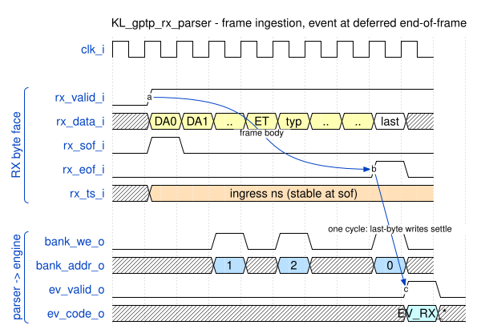

**🏛 The Architect.** Byte-serial, not word-parallel: the frame arrives
one byte per cycle from a MAC and there is no rate to be gained by
buffering it. This block is deliberately dumb about protocol *meaning*
— it packs fields into a bank and raises one event. Every decision
about what a frame *means* belongs to µcode, where it can change
without re-synthesis.

**📐 The Protocol Engineer.** It extracts the 10.5.2 common header and
each per-type body into fixed bank words, and walks the 10.5.3.3 path
trace TLV (capped at 8 hops, but it reports the *true* hop count so
µcode can tell a capped read from a complete one — a capped announce
is treated as unqualified because absence of our identity cannot be
proven). It enforces the four framing conditions that make a frame
*not ours*: EtherType ≠ 0x88F7, `transportSpecific` ≠ 1 (10.5.2.2.1),
`versionPTP` ≠ 2 (10.5.2.2.4), and `domainNumber` ≠ 0 — gPTP is a
single domain (8.1). Each is counted and silently dropped, never
escalated to an event.

**⚙ The RTL Designer.** No backpressure on the byte face by contract —
the integrator's control FIFO owns rate matching. The subtle part is
the deferred end-of-frame: `fin_r` delays the event by one cycle so
the last byte's field writes and the per-type minimum flag have landed
before the event fires, and so the announce hop-count word does not
fight the final identity write for the single bank write lane.

**🔬 The Verification Engineer.** 32 checks in `tb/verilator/parser`,
frames built byte-by-byte in C++ from the standard — never from the
RTL. Six drop arms, each mutation-proven. This suite has already
earned its keep: it caught three field-straddle bugs and an
end-of-frame race *before* the first synthesis, and the domain arm was
added the day the documentation claimed a check that did not exist.

**🔭 The Bench Engineer.** Its drop counter is the `Q=` field on the
UART line. On the bench it counts more than protocol errors: there is
no EtherType classifier in front of the parser, so every flooded frame
on the switch lands here too. `Q` climbing at a few per second on a
busy switch is normal; `C` (CRC) climbing is not.

---

## 2. `KL_gptp_ucpu` — the sequencer that is the protocol

**2,014 LUT (1,701 standalone) · 731 FF · 1.5 BRAM · 4 DSP** ·
generated detail: `docs/generated/doc_internal/KL_gptp_ucpu.md`

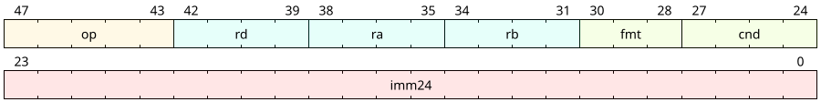

**🏛 The Architect.** This is the AECP µCPU with two opcodes added and
nothing removed — deliberately, so its out-of-context delta prices the
arithmetic growth alone: **+631 LUT** for 64-bit ALU plus multiply and
divide. The shifts are serial and the divide is restoring, one bit per
cycle, because at 8 Hz a 64-cycle divide is free and a barrel shifter
is not. Keeping every unused base opcode in place costs area but buys
a number nobody can argue with.

**📐 The Protocol Engineer.** Nothing in this block knows what gPTP is.
That is the point: 802.1AS lives in `hdl/ucode/gen_gptp_ucode.py`, one
handler per event, and the clause-by-clause mapping is
`FSM_CONFORMANCE.md`.

**⚙ The RTL Designer.** F/D/E pipeline, single pending-writeback
interlock for RAW hazards, branches resolve in E and flush F/D.
Multi-cycle operations (state access, gather, build, shift, mul, div,
send) hold E — which is how backpressure from the TX slot reaches all
the way back into instruction issue without a single extra signal.
Dispatch preloads three registers and the machine runs until `OP_END`.

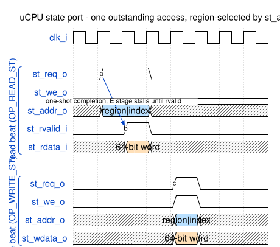

All engine state is reached through **one** port, region-selected by
`st_addr[19:16]`; reads are one-shot with `st_rvalid`, writes are
single-cycle. One port for six regions is why the top level is only
176 LUT of glue.

**🔬 The Verification Engineer.** 768 checks against an independent C++
model of the arithmetic: every ALU function, both MULDIV functions,
directed edges (sign boundaries, shift counts 0/1/63/64, divide
extremes) and 64 random operand pairs each, dispatched through the
real handshake. If this block is wrong, every timestamp computation in
the plane is wrong, so it is checked hardest.

---

## 3. The event queue and dispatch — the engine's own contribution

**176 LUT · 1,017 FF** (the top level's own logic: region mux, queue,
banks, publish registers)

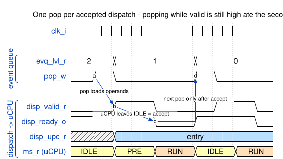

**🏛 The Architect.** Three asynchronous sources — a frame, an egress
timestamp, a timer — and one sequencer. The queue is four deep and
strictly arrival-ordered, because gPTP's correctness depends on the
*order* of events (a Follow_Up after its Sync, an egress stamp after
its send) far more than on their latency.

**⚙ The RTL Designer.** Priority is a policy, not an accident: the
parser wins a same-cycle push (a frame in flight cannot be asked to
wait), an egress-timestamp return pends until there is room, and the
timer holds its event on a valid/ready handshake. Dispatch is gated on
`ser_idle` so a handler never builds into a slot still on the wire.

The rule the waveform above exists to state: **one pop per accepted
dispatch.** The µCPU acknowledges by leaving IDLE one cycle after
`disp_valid`; popping again while valid is still high clobbers the
preload operands mid-handshake and silently eats the second event.

**🔬 The Verification Engineer.** That last sentence is not
hypothetical — it was a real bug, found by the engine suite when
become-master ran with a TX-timestamp event's operands and the
timestamp event vanished. Found in simulation, before a bitstream
existed. The 144-check suite drives every event type back-to-back for
exactly this reason.

---

## 4. `KL_gptp_timer` — eight deadlines, one millisecond apart

**248 LUT · 321 FF** ·
generated detail: `docs/generated/doc_internal/KL_gptp_timer.md`

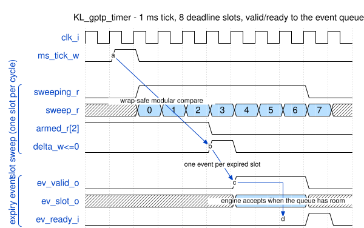

**🏛 The Architect.** Every cadence and every timeout in gPTP is a
millisecond-scale deadline. Eight of them, swept one slot per cycle
after each tick, is a few hundred LUT; a counter per protocol timer
would be more, and less flexible — µcode decides what a slot *means*.

**📐 The Protocol Engineer.** Slot 0 pdelay cadence (1 s) plus the
one-time init and the asCapable ladder; slot 1 Sync TX (125 ms, Milan
Table 4.1); slot 2 `announceReceiptTimeout` (3 s, 10.6.3.2); slot 3
Announce TX (1 s); slot 4 `syncReceiptTimeout` (375 ms, 10.6.3.1).
Slots 5–7 are free — the next protocol timer costs zero fabric.

**⚙ The RTL Designer.** Wrap-safe modular compare (`deadline − now` as
signed), so the 32-bit ms timebase can roll over without a special
case. An arm in the same cycle as an expiry wins — that is the
periodic-cadence idiom, and it is why a handler can re-arm its own
slot as its first action.

**🔭 The Bench Engineer.** Bootstrap matters here: nothing arms a timer
before µcode runs, and no µcode runs before an event. The engine
therefore arms slot 0 once, ~256 cycles after reset, and the slot-0
handler owns its re-arm from then on. If you ever see a board that
links but never transmits, that is the first thing to check.

---

## 5. `KL_gptp_tx_slot` — the PDU under construction

**72 LUT · 24 LUTRAM · 62 FF** ·
generated detail: `docs/generated/doc_internal/KL_gptp_tx_slot.md`

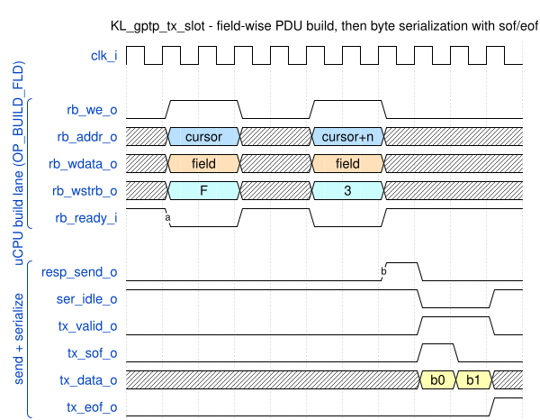

**🏛 The Architect.** 128 bytes — the largest PDU this plane emits is an
Announce with an 8-hop path trace. Fields are written at byte cursor
addresses so µcode can build a PDU in wire order without ever knowing
about alignment.

**⚙ The RTL Designer.** The unpack FSM is the interesting cycle:

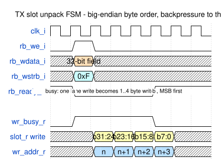

One 32-bit lane write becomes 1…4 byte writes, most-significant first
(wire order), with `rb_ready` low throughout. That refusal propagates
into the µCPU's E stage, so a build can never overrun the slot and
nothing races. `SEND` latches the built length and streams with
`sof`/`eof`.

**🔬 The Verification Engineer.** Every transmitted frame in the engine
suite is checked byte-by-byte, and then again — independently — by
tsn-gen's `packet_gen` decoding it against the 802.1AS YAMLs. That
second judge caught a `control` field this repo's own harness had
never looked at.

---

## 6. The publish bank — the software contract, as wires

**🏛 The Architect.** This is the whole point of the exercise. Every
word here is something a host service used to poll and mirror into a CSR;
now it is a latched output, updated by µcode and strobed by
`OP_COMMIT`. Eight words, +18 LUT for the last one.

**📐 The Protocol Engineer.** GM identity, parent identity, flags,
meanLinkDelay, offset, the raw received announce vector,
`{stepsRemoved, timeSource}` of the adopted announce, and
neighborRateRatio. The mapping to AVDECC/Milan consumers and to the
CSRs each replaces is `MGMT_INTERFACE.md`.

**🔌 The Integrator.** Latch on `pub_commit_o` or free-run — each word
is written in a single cycle, and the strobe marks a coherent group.
The one input alongside them is `cfg_asym_i` (delayAsymmetry,
10.2.4.5): a per-port managed object, and **only the slave side of a
link may apply it**, or the correction doubles.

**🔭 The Bench Engineer.** Words 0–5 plus the live asymmetry are the 1 Hz
UART line. `F=07` capable master, `F=05` capable slave, `F=0D` synced
slave, `F=00` not asCapable. Full field table in
`BENCH_OPERATIONS.md`.

---

## 7. The µcode image — where the protocol actually lives

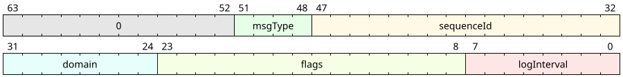

**🏛 The Architect.** 849 of 1,024 words. Fixed entry points are
mirrored by the engine's entry table; shared legs are **auto-packed**
first-fit-decreasing into the free windows between them, so protocol
growth is an assertion failure rather than a corrupt image. Unused
words are filled with a SplitMix pattern, not zeros, so a µPC that
escapes decodes as garbage and fails loudly in simulation instead of
quietly running NOPs.

**📐 The Protocol Engineer.** 
Every path in that flowchart is a clause. The two that took the
longest to get right:

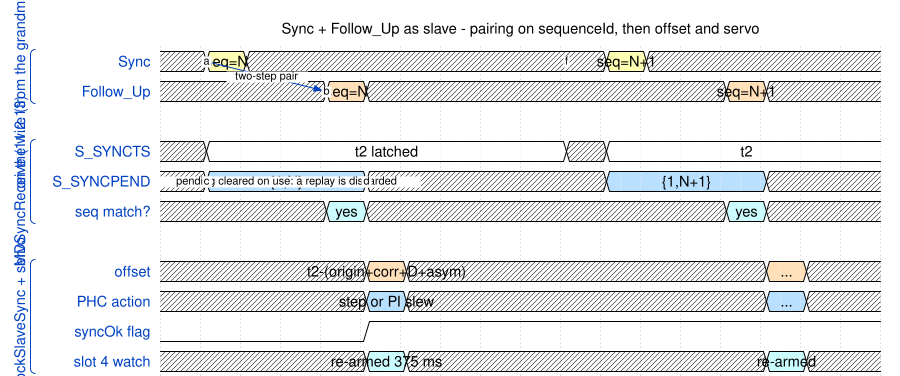

*MDSyncReceive (11.2.13)* — a Follow_Up is only assembled when a Sync
is pending **and** carries its `sequenceId`; the pending word is
cleared on use, so a replayed or crossed Follow_Up is discarded rather
than corrupting the offset.

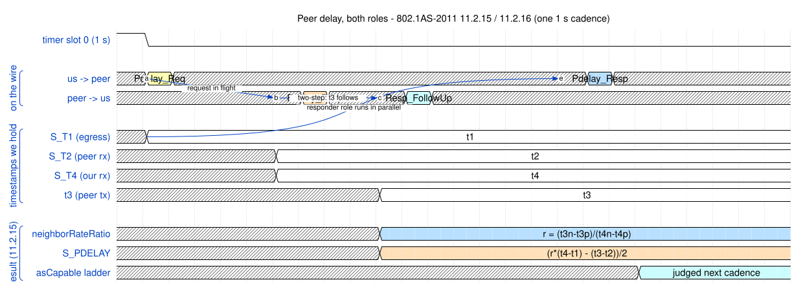

*MDPdelayReq (11.2.15)* — both roles run every second; the rate ratio
`r = (t3ₙ−t3ₚ)/(t4ₙ−t4ₚ)` is carried in Q16 with a [0.99, 1.01] sanity
band and feeds `meanLinkDelay = (r·(t4−t1) − (t3−t2))/2`. The
asCapable ladder then judges *the previous interval*: exactly one
responder, its Follow_Up seen, delay under threshold.

**⚙ The RTL Designer.** The servo is µcode too — no fabric:

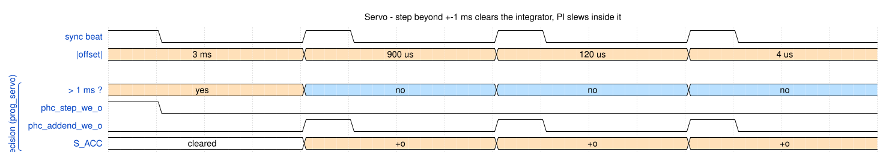

**🔬 The Verification Engineer.** The PI arithmetic is checked
**bit-exact** against a C++ mirror of the same shifts and saturation,
then closed-loop against a modeled detuned PHC that obeys the DUT's
own addend and step writes. 16 targeted mutations across the µcode,
all caught — including one that initially *survived* and exposed a
stimulus hole (every simulated peer ran at exactly our rate, making
the rate-ratio correction a no-op; a 1000 ppm skewed peer fixed that).

**🔭 The Bench Engineer.** All of it is one `gptp_ucode.hex` file.
Changing the profile threshold, our priority or the MAC is a
regenerate-and-reflash, not a re-verify — and the two bench bitstreams
differ by exactly one constant.

---

## 8. Bench-only blocks

Not part of the IP — they exist so the engine can meet a real PHY.
`bench_mii_rx` / `bench_mii_tx` (MII ↔ byte stream, preamble/SFD,
CRC32, IFG, SFD toggles for timestamping), `bench_afifo` (dual-clock,
gray pointers), `bench_phc` (Q8.24 accumulator honouring addend and
step), `bench_uart_report` (the 1 Hz line), `bench_uart_tune` (runtime
calibration).

**🔬 The Verification Engineer.** These get their own 81-check suite —
added *after* a truncated FIFO level in the TX gasket deadlocked the
whole plane on the wire. The engine had honoured its backpressure
contract perfectly; the bench gasket lied about its level. The lesson
is in `VERIFICATION.md` under "what simulation does not cover", and
the wedge regression now recreates that exact race every run.

---

## Tooling note — how these artefacts are made, and one honest caveat

`python3 docs/tools/gen_docs.py` regenerates everything:

| tool | artefact | status |
|---|---|---|
| **TerosHDL** (`teroshdl-hdl-documenter`) | per-module port/signal/constant/process tables + block SVG, in `docs/generated/` | works **through a shim** — see below |
| **WaveDrom** (`wavedrom-cli`) | 12 timing and bitfield diagrams from `.json` sources | works directly |
| **Mermaid** (`mmdc`) | 3 block/flow diagrams from `.mmd` sources | works directly |

**The TerosHDL caveat, stated plainly.** Its documenter parses HDL with
a vendored tree-sitter-verilog grammar that rejects two
SystemVerilog-2012 constructs this codebase uses throughout — typed
parameters (`parameter int unsigned CLK_HZ_P = 100_000_000`) and width
casts (`($clog2(US_DIV_C))'(US_DIV_C - 1)`). With either present the
parse tree is an ERROR node, the documenter's model comes back
undefined and it exits having written nothing. (On Node ≥ 18 its
Emscripten runtime additionally needs `globalThis.fetch` removed
before it will load its own wasm; both Node 18 and 22 were tried.)

`gen_docs.py` therefore writes a **documentation copy** of each source
with those two constructs rewritten to their pre-2012 equivalents, and
runs the documenter on the copy. The rewrite touches declaration
syntax only — port names, directions, widths, comments and module
structure, which is everything the documenter reports, are untouched;
the copies live in `/tmp` and are never synthesised. One cosmetic
artefact survives in its output: TerosHDL renders the underscored
literal `100_000_000` as `_000_000` in the generics table. The true
values are in `ARCHITECTURE.md` §9.
